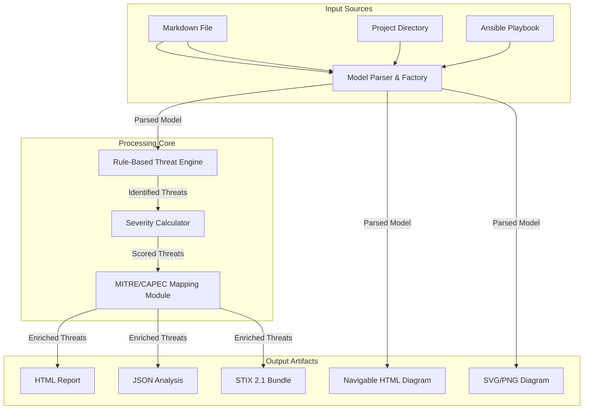
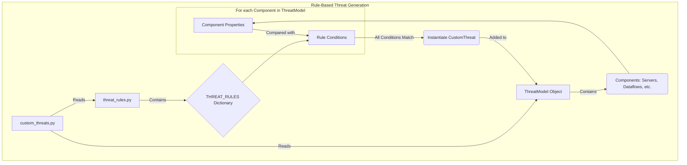
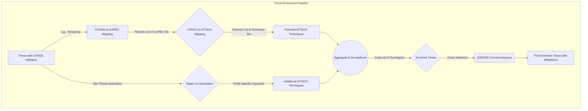
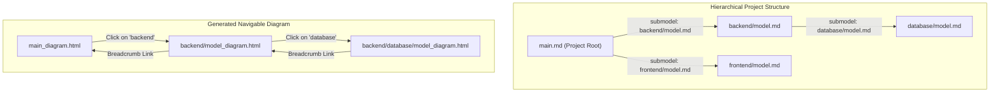

# SecOpsTM: A Technical Deep Dive

## 1. Introduction

### 1.1. The Challenge: From Manual Diagrams to Automated Analysis

As software systems grow in complexity, proactively identifying security vulnerabilities during the design phase is significantly more effective than reacting to them post-deployment. Threat modeling provides a structured process for this, but traditional approaches often rely on manual diagramming and static documents that are difficult to maintain and impossible to integrate into automated development pipelines.

This document provides a detailed technical overview of the **SecOpsTM** framework, a tool designed to address these challenges by treating the threat model as a living artifact that evolves with the system itself.

### 1.2. Core Philosophy: System-Level Threat Model as Code

The guiding philosophy of this framework is **Threat Model as Code (TMaC)**, applied at the **system level**. Instead of focusing on abstract application components, our approach defines the entire system architecture—including infrastructure, network boundaries, and data flows—in a simple, version-controllable format.

This is particularly powerful when generating models directly from **Infrastructure as Code (IaC)** sources like Ansible playbooks. By parsing the same files that define the deployed environment, the framework creates a threat model that is a true representation of the running system. This enables a seamless, automated workflow where changes in infrastructure are immediately reflected in the threat analysis.

By defining the system in a Markdown DSL, the threat model becomes:
-   **Versioned**: Stored in Git to track its evolution alongside the source code and infrastructure code.
-   **Automated**: Integrated directly into CI/CD pipelines to run analysis on every change.
-   **Collaborative**: Developers and operations engineers can contribute using the same tools and workflows they use for code.

## 2. Comparison with Other Threat Modeling Tools

To understand the unique value of SecOpsTM, it's useful to compare it to other popular tools, focusing on the key differentiator: **automation**.

| Feature | Microsoft TMT | OWASP Threat Dragon | SecOpsTM (This Tool) |
| :--- | :--- | :--- | :--- |
| **Primary Paradigm** | GUI-based Diagramming | Web-based Diagramming | **Threat Model as Code (TMaC)** |
| **Input Format** | Proprietary `.tm7` format | JSON, with a web UI | **Markdown (DSL) / IaC Playbooks** |
| **Automation & CI/CD** | None. Fully manual process. | Limited. Has an API but is not designed for pipeline integration. | **Core Feature**. Designed to be run from the CLI in a pipeline. |
| **IaC Integration** | None. | None. | **Yes (Ansible)**. Can generate a model directly from infrastructure definitions. |
| **Version Control** | Possible by archiving the `.tm7` model file. However, the format is complex (XML-based) and not well-suited for line-by-line diffing or merging. | Feasible (JSON), but the diagram is the primary source of truth, not the code. | **Seamless**. Markdown is text-based and ideal for Git. |
| **Extensibility** | Limited to templates. | Good. Open-source and extensible. | **High**. Mappings and logic are in simple Python dictionaries and modules. |
| **Visualization & Reporting** | Basic reports. | Printable report, basic threat view. | Rich HTML reports, STIX 2.1 export, **MITRE ATT&CK Navigator layers**. |

## 3. High-Level Architecture

The framework is a Python-based application that can be run as a command-line tool (for automation) or a web server (for interactive editing). It ingests a threat model source and produces a suite of artifacts.



## 4. Technical Deep Dive: Module by Module

This section provides a comprehensive breakdown of each component of the SecOpsTM framework.

### 4.1. Entrypoint and Orchestration (`threat_analysis/__main__.py`)

The execution of the framework begins in `__main__.py`. This script is responsible for:
-   **Argument Parsing**: It uses a `CustomArgumentParser` to handle command-line arguments. This includes standard arguments like `--model-file`, `--gui`, `--project`, and `--navigator`, but it also dynamically loads IaC plugins from the `iac_plugins` directory and adds corresponding arguments for them (e.g., `--ansible-path`).
-   **Mode Selection**: It determines the execution mode based on the arguments:
    -   `--server`: Launches the unified Flask web server, which provides a menu to select between the simple viewer and the full graphical editor.
    -   `--project`: Initiates a hierarchical project analysis via `report_generator.generate_project_reports()`.
    -   `--<iac-plugin>-path`: Triggers the IaC import workflow.
    -   Default: Proceeds with a standard single-file analysis.
-   **Framework Orchestration**: For standard and IaC-based runs, it instantiates the `ThreatAnalysisFramework` class, which coordinates the entire analysis pipeline from model loading to report generation. If the `--navigator` flag is present, it also triggers the generation of the ATT&CK Navigator layer. For project-based runs, it calls `report_generator.generate_project_reports()` and then, if the `--navigator` flag is present, generates a consolidated ATT&CK Navigator layer for the entire project.

### 4.2. Core Model (`threat_analysis/core/models_module.py`)

The `ThreatModel` class is the heart of the framework, serving as the in-memory representation of the system under analysis. It is designed to be a rich, stateful object that not only holds the architectural components but also orchestrates the analysis process.

-   **A Wrapper Around PyTM**: At its core, the `ThreatModel` class wraps a `pytm.TM` object. This allows the framework to leverage the foundational threat generation logic of the PyTM library while extending it with custom features, more detailed component attributes, and advanced analysis capabilities.

-   **Self-Initialization of MitreMapping**: The `ThreatModel` class now self-initializes its `MitreMapping` instance. This simplifies the constructor of `ThreatModel` and centralizes the management of the `MitreMapping` dependency within the `ThreatModel` itself, improving modularity and testability.

-   **Key Data Structures**: The class maintains several dictionaries and lists to manage the components of the threat model:
    -   `boundaries`, `actors`, `servers`, `dataflows`, `data_objects`: These collections store not just the `pytm` objects themselves, but also associated metadata defined in the Markdown DSL, such as custom properties, colors for diagramming, `businessValue` for impact assessment, or links to sub-models.
    -   `protocol_styles`: A dictionary to store custom styling rules for dataflow protocols (e.g., making `HTTPS` flows appear as green solid lines and `HTTP` as red dashed lines in diagrams).
    -   `severity_multipliers`: Stores multipliers for specific components, allowing for a more nuanced risk calculation.
    -   `_elements_by_name`: This dictionary is a critical optimization. It provides an O(1) lookup for any component in the model by its name, which is essential for quickly resolving relationships during parsing and analysis (e.g., finding the source and sink objects for a dataflow).

-   **Element Management**: The `add_*` methods (e.g., `add_boundary`, `add_server`, `add_dataflow`) are the primary interface for building the model. They are responsible for:
    1.  Creating the underlying `pytm` object.
    2.  Storing the object along with its extended attributes in the appropriate collection.
    3.  Populating the `_elements_by_name` lookup table.

-   **Custom Threats**: The module also defines a `CustomThreat` class. This simple class allows the framework to represent threats that are not part of the standard STRIDE model generated by PyTM. These custom threats are defined in the `threat_rules.py` file and are instantiated and added to the model during the analysis process. The `severity_info` for custom threats is now calculated and assigned to the `CustomThreat` object when it is created.

-   **The Analysis Engine: `process_threats()`**: This is the most important method in the class. It serves as the orchestrator for the entire threat analysis pipeline, executing the following steps in order:
    1.  **Validation**: It first calls the `ModelValidator` to ensure the model is consistent and complete (e.g., no dataflows pointing to non-existent elements).
    2.  **PyTM Threat Generation**: It calls `self.tm.process()` to trigger the standard PyTM threat generation.
    3.  **Target Expansion**: It calls `_expand_class_targets()`, a crucial helper method that takes generic threats targeted at a *class* of objects (e.g., a threat against all `Server` objects) and creates a specific threat instance for every `Server` defined in the model. This ensures that all components are evaluated correctly.
    4.  **Custom Threat Generation**: It integrates custom threats defined in the rule-based engine (`custom_threats.py`).
    5.  **Grouping**: It groups all generated threats (both from PyTM and custom rules) by their STRIDE category.
    6.  **MITRE Analysis**: Finally, it triggers the MITRE ATT&CK mapping and enrichment process.

-   **`get_all_threats_details()`**: This method provides a clean, comprehensive list of all identified threats, including their description, target, STRIDE category, severity, and associated MITRE techniques. This is the primary data source for the report generation modules.

### 4.3. Model Parsing and Validation

-   **`model_factory.py`**: The `create_threat_model` function acts as a centralized factory. It simplifies the creation process by encapsulating the instantiation of `ThreatModel`, `ModelParser`, and `ModelValidator`, ensuring a consistent and valid model is produced. The `create_threat_model` function no longer takes `mitre_mapping` as an argument, as the `ThreatModel` now handles its own `MitreMapping` instance internally.
-   **`model_parser.py`**: The `ModelParser` class is responsible for translating the Markdown DSL into the in-memory `ThreatModel` object. For a detailed guide on defining threat models using the Markdown DSL, refer to the [Defining Your Threat Model](defining_threat_models.md) documentation. For a detailed guide on defining threat models using the Markdown DSL, refer to the [Defining Your Threat Model](defining_threat_models.md) documentation.
    -   It employs a **two-pass parsing strategy**. The first pass processes element definitions (Boundaries, Actors, Servers, Data) to ensure all components exist before relationships are established. The second pass processes Dataflows and other configurations that reference these elements.
    -   The `_parse_key_value_params` method uses a regular expression to flexibly parse `key=value` attributes, handling quoted strings, booleans, and numbers.
-   **`model_validator.py`**: The `ModelValidator` ensures the integrity of the parsed model. It performs several checks:
    -   **Unique Names**: Verifies that all elements (actors, servers, dataflows, etc.) have unique names.
    -   **Dataflow References**: Confirms that the `from` and `to` fields in dataflows refer to elements that actually exist in the model.
    -   **Boundary References**: Ensures that actors and servers assigned to a boundary refer to a defined boundary.
    -   **Dataflow Endpoints**: Validates that dataflows do not connect directly to boundaries. Endpoints must be components like actors or servers.

### 4.4. Threat Generation Engine

The framework's custom threat generation is driven by a flexible, rule-based engine that complements the standard threat generation provided by the underlying PyTM library. This engine allows for the definition of highly specific, context-aware threats that are tailored to the architecture defined in the model. The engine is composed of two main files: `threat_rules.py` and `custom_threats.py`.

### 4.4.1. PyTM's Built-in Threat Generation

The core of the framework leverages the `pytm` library for its foundational threat generation capabilities. When `threat_model.process_threats()` is called, `pytm` automatically analyzes the defined architecture (actors, servers, dataflows, and their properties) to identify potential STRIDE threats.

**How PyTM Generates Threats:**
`pytm` applies a set of predefined rules based on the relationships and properties of elements in the threat model. For example:
*   A dataflow between an actor and a server might trigger "Spoofing" or "Repudiation" threats.
*   Dataflows marked as unencrypted (`is_encrypted=False`) can lead to "Information Disclosure" threats.
*   Servers with specific stereotypes (e.g., "Database") might generate threats related to data tampering or unauthorized access.

**Influencing PyTM's Threats:**
To "add" or "remove" threats generated directly by `pytm`, you primarily need to modify the underlying architecture of your threat model. This includes:
*   **Adding/Removing Elements:** Introducing new actors, servers, or dataflows can trigger new `pytm` threats. Conversely, removing elements can eliminate threats associated with them.
*   **Modifying Element Properties:** Changing properties like `is_encrypted` for dataflows, or `stereotype` for servers, can alter the set of threats `pytm` generates.
*   **Structuring Boundaries:** How elements are placed within trust boundaries can also influence `pytm`'s threat identification.

**Filtering PyTM Threats:**
While `pytm` generates a comprehensive set of threats, the framework allows for post-processing and filtering. The `_expand_class_targets` method in `models_module.py` and the overall threat processing pipeline can be extended to filter or modify `pytm`-generated threats before they are presented in reports.

### 4.4.2. Customizing PyTM's Threat Database

The `pytm` library allows security practitioners to supply their own custom threat definitions, which can augment or override its default threat generation logic. This is achieved by setting the `TM.threatsFile` property to a path pointing to a JSON file containing these custom threats.

**Threats.json File Format:**
The `threats.json` file is expected to be a JSON array (list) of threat objects. Each threat object is a dictionary that defines a specific threat and the conditions under which it applies. While the exact schema can vary, common attributes include:
*   `name`: A unique identifier for the threat.
*   `description`: A detailed description of the threat.
*   `category`: The STRIDE category (e.g., "Information Disclosure", "Tampering").
*   `impact`: An integer representing the potential impact (e.g., 1-5).
*   `likelihood`: An integer representing the likelihood of occurrence (e.g., 1-5).
*   `condition`: (Optional) A Python code snippet that defines the conditions under which this threat is applicable. This code is executed against the elements of the threat model.

**Example `threats.json` entry (conceptual):**
```json
[
  {
    "name": "Unencrypted Sensitive Dataflow",
    "description": "Sensitive data transmitted over an unencrypted channel.",
    "category": "Information Disclosure",
    "impact": 5,
    "likelihood": 4,
    "condition": "dataflow.is_encrypted == False and dataflow.data.classification == 'TOP_SECRET'"
  }
]
```

**Using `threatmd` to Generate `threats.json`:**
The `threatmd` tool ([https://github.com/raphaelahrens/threatmd](https://github.com/raphaelahrens/threatmd)) provides a convenient way to define these custom threats using Markdown files and then transform them into the `threats.json` format compatible with `pytm`.

**Process with `threatmd`:**
1.  **Define Threats in Markdown:** Create individual Markdown files for each custom threat, following the `threatmd` format (including metadata fields like `sid`, `severity`, `target`, `likelihood`, and a `Condition` block with Python code).
2.  **Generate `threats.json`:** Run the `threatmd` tool, pointing it to your directory of Markdown threat definitions:
    ```bash
    threats_pytm <directory of markdown threats> > threats.json
    ```
    This command will print the generated JSON to standard output, which you can redirect to a `threats.json` file.
3.  **Integrate with PyTM:** In your Python code, before processing the threat model, set the `TM.threatsFile` property to the path of your generated `threats.json` file. For example:
    ```python
    from pytm import TM
    # ...
    tm_instance = TM("My Threat Model")
    tm_instance.threatsFile = "path/to/your/threats.json"
    tm_instance.process()
    ```

**Ignoring Specific Threats:**
The framework does not currently expose a direct `-ignore` parameter for `pytm`-generated threats. However, you can achieve similar results by:
*   **Modifying `threats.json`:** If using a custom `threats.json` file, simply remove the unwanted threat entries from the file.
*   **Filtering Post-Generation:** After `pytm` generates its threats, you can implement custom logic within the framework (e.g., in `models_module.py` or `report_generator.py`) to filter out specific threats based on their properties before they are processed or reported.

-   **`threat_rules.py`: The Rulebook**: This file acts as a declarative "rulebook" for the threat generation engine. It contains a single, large dictionary called `THREAT_RULES`.
    -   **Structure**: The dictionary is organized by component type (`servers`, `dataflows`, `actors`). Each component type contains a list of rules.
    -   **Rule Definition**: Each rule is a dictionary with two key parts:
        -   `conditions`: A dictionary specifying the properties a component must have for the rule to be triggered. For example, a dataflow rule might have `{"is_encrypted": False, "protocol": "HTTP"}`.
        -   `threats`: A list of threat templates to be generated if all conditions are met. Each template is a dictionary that defines the threat's `description`, `stride_category`, `impact`, and `likelihood`. Additionally, `capec_ids` can be added to a threat to provide a direct mapping to a specific CAPEC.

    -   **Example Rule**:
        ```python
        # From THREAT_RULES['dataflows']
        {
            "conditions": {
                "is_encrypted": False,
                "protocol": "HTTP"
            },
            "threats": [
                {
                    "description": "Sensitive data transmitted over unencrypted HTTP",
                    "stride_category": "Information Disclosure",
                    "impact": 4,
                    "likelihood": 4
                }
            ]
        }
        ```
        This rule states: "If a dataflow is not encrypted AND uses the HTTP protocol, then generate an 'Information Disclosure' threat."

-   **`custom_threats.py`: The Engine Itself**: This module contains the `get_custom_threats` function which acts as the engine that interprets the rules. This module has been refactored to use a more robust property lookup mechanism (`_get_property`) that supports nested attributes (e.g., `source.inBoundary.isTrusted`), making the rule application more powerful and flexible.
    -   **`get_custom_threats(threat_model)`**: This function is the main entry point for the custom threat generation process. It takes the fully parsed `ThreatModel` object as input.
    -   **Iteration and Matching**: The function iterates through every component (server, dataflow, actor, etc.) in the `threat_model`. For each component, it retrieves the relevant rules from `THREAT_RULES` (based on the component's type). It then checks if the component's properties match all the `conditions` specified in a rule.
    -   **Boundary-Aware Logic**: A key feature of the engine is its ability to handle complex conditions, especially for dataflows. It can check the properties of the source and sink of a dataflow, including which boundary they are in. For example, a rule can be written to only trigger a threat if a dataflow crosses from an untrusted boundary (like the "Internet") to a trusted one (like the "Internal Network").
    -   **Threat Instantiation**: If a component's properties match all the conditions of a rule, the engine uses the threat templates associated with that rule to create new `CustomThreat` objects. These objects are then added to the list of threats in the `ThreatModel`.

This two-part design (declarative rules + an engine to interpret them) makes the threat generation highly extensible. To add a new threat, a developer only needs to add a new entry to the `THREAT_RULES` dictionary; no changes to the engine's code are required.



### 4.5. The STRIDE, CAPEC, and ATT&CK Mapping (`mitre_mapping_module.py`)

This is the most complex and critical module for enriching the raw threat data. It transforms high-level STRIDE threats into specific, actionable MITRE ATT&CK techniques through a chained mapping process that leverages established cybersecurity knowledge bases. The module was recently updated to fix a bug where the D3FEND mitigation name was not being correctly displayed in the report. The fix involved updating the regex to correctly parse the mitigation name from the `ATTACK_D3FEND_MAPPING` and updating the report template to display the name instead of the description.

-   **`MitreMapping` Class**: The central class that orchestrates the entire enrichment pipeline.
    -   **Initialization**: When instantiated, it pre-loads and processes several external data sources to build its mapping tables:
        -   `capec_to_mitre_structured_mapping.json`: This file provides the crucial link between CAPEC (Common Attack Pattern Enumeration and Classification) and MITRE ATT&CK techniques. The module parses this to create a `capec_to_mitre_map`.
        -   `stride_to_capec.json`: This file maps each STRIDE category to a list of relevant CAPEC patterns.
        -   `d3fend.csv`: This file maps ATT&CK techniques to D3FEND countermeasures, providing defensive context.
        -   `nist800-53-r5-mappings.xlsx`: This file maps ATT&CK techniques to NIST 800-53 R5 controls.
        -   **`cis_to_mitre_mapping.json`**: This newly integrated file provides mappings from CIS Controls to MITRE ATT&CK techniques. It is generated by `tooling/cis_controls_parser.py` and includes the full name and a specific URL for each CIS control.

-   **Automated Enrichment Pipeline**: The framework follows a systematic, multi-step process to map threats:
    1.  **STRIDE to CAPEC**: For a given threat, its STRIDE category (e.g., "Tampering") is used to look up a list of associated CAPEC patterns from the `stride_to_capec.json` data.
    2.  **CAPEC to ATT&CK**: Each of a threat's associated CAPEC IDs is then used as a key in the `capec_to_mitre_map` (built from the `capec_to_mitre_structured_mapping.json` file) to find a list of corresponding MITRE ATT&CK technique IDs.
    3.  **Description-Based Refinement (Secondary Mapping)**: In addition to the primary STRIDE-based mapping, the system also uses a set of regex patterns to find keywords directly within the threat's description (e.g., mapping the term "sql injection" directly to T1190). This acts as a secondary mechanism to catch highly specific threats or variations not covered by the broader STRIDE-to-CAPEC mapping.
    4.  **Aggregation and Uniqueness**: The techniques identified from both the primary (STRIDE-based) and secondary (description-based) mappings are combined, and duplicates are removed to produce a final, unique list of enriched MITRE ATT&CK techniques for the threat.
    5.  **D3FEND Countermeasures**: Finally, the identified ATT&CK techniques are cross-referenced with the D3FEND data to attach relevant countermeasures and mitigations.
    6.  **NIST Controls**: The identified ATT&CK techniques are also cross-referenced with the NIST data to attach relevant NIST 800-53 R5 controls.
    7.  **CIS Controls**: The identified ATT&CK techniques are now also cross-referenced with the `cis_to_mitre_mapping.json` data to attach relevant CIS Controls.



### 4.6. Severity Calculation (`severity_calculator_module.py`)

The `SeverityCalculator` provides a nuanced risk score for each threat.
-   **Multi-Factor Calculation**: The final score is not a static value but a composite calculated from:
    1.  **Base Score**: A default score for each STRIDE category.
    2.  **Rule-Defined Score**: The impact and likelihood values (1-5) defined in the `threat_rules.py` entry for that threat.
    3.  **Target Multipliers**: The score can be increased by multipliers defined in the `## Severity Multipliers` section of the threat model, which are loaded from the markdown file.
    4.  **Protocol Adjustments**: The protocol of a dataflow can adjust the score (e.g., HTTP increases it, HTTPS decreases it).
    5.  **Data Classification**: The classification of the data in a flow (`PUBLIC`, `SECRET`, etc.) acts as a final multiplier.
-   **Normalization**: The final score is clamped between 1.0 and 10.0 and assigned a qualitative level (e.g., "HIGH", "CRITICAL").

### 4.7. Output Generation (`generation/`)

-   **`diagram_generator.py`**: This module is responsible for all visual representations.
    -   It uses a Jinja2 template (`threat_model.dot.j2`) to generate Graphviz DOT language code from the `ThreatModel` object.
    -   **Visual Styling**: The generator includes sophisticated logic for rich visual styling, combining native Graphviz shapes with embedded SVG icons. The layout of the icon and text is adjusted based on the element type for maximum clarity:
        -   **Native Shapes & Sizing**: It assigns semantic shapes to elements and sets their sizes for a clean visual hierarchy:
            -   **Actors**: Rendered as fixed-size **circles**.
            -   **Switches and Firewalls**: Rendered as fixed-size diamonds and hexagons, respectively, which are smaller than other nodes for visual distinction.
            -   **Servers (generic, web, API)**: Rendered as **rectangles** with a minimum width and height to enforce a consistent aspect ratio.
            -   **Databases**: Rendered as cylinders.
        -   **Conditional Icon & Text Layout**: The placement of the icon and text label is conditional:
            -   For **generic servers**, the icon and centered text are rendered **side-by-side** on the same line, providing a compact view.
            -   For **all other elements** (actors, firewalls, web servers, etc.), the icon is rendered **above** the text, creating a top-down layout.
        -   **Icon Implementation**: This is achieved using Graphviz's HTML-like labels, which embed scaled SVG icons (e.g., 30x30 points) inside the node's shape. If an SVG icon is not found, the system falls back to a text-based Unicode character icon. Element types are mapped to specific SVG icons using the `ICON_MAPPING` dictionary in `threat_analysis/config_generator.py`. This mapping supports elements like `actor`, `web_server`, `database`, `firewall`, `router`, `switch`, `server`, `api_gateway`, `app_server`, `central_server`, `authentication_server`, and `load_balancer`. If an element's type is not found in this mapping, a default emoji is used.
    -   It calls the `dot` command-line tool to render the DOT code into SVG, PNG, or other formats.
    -   **Navigable Diagrams**: For hierarchical projects, it makes diagrams navigable by post-processing the SVG. The `add_links_to_svg` function uses Python's `xml.etree.ElementTree` to find SVG nodes corresponding to elements with a `submodel` property and wraps them in an `<a>` hyperlink tag pointing to the sub-model's diagram.
    -   **`report_generator.py`**: Creates the primary user-facing artifacts.
        -   It uses Jinja2 templates (`report_template.html`, `navigable_diagram_template.html`) for generating rich HTML outputs. The `report_template.html` is responsible for rendering all threat details, including the various types of mitigations (MITRE, D3FEND, CIS, etc.) associated with each identified ATT&CK technique. It also includes a new filter for `businessValue`, allowing users to view threats based on the business impact assigned to assets. The template uses unique boolean variables for each mitigation type (e.g., `mitre_mitigations_found`, `d3fend_mitigations_found`) to correctly display a "No specific mitigations found" message when appropriate.    -   **Consistent MitreMapping Usage**: The `ReportGenerator` now consistently uses its `self.mitre_mapping` instance for all mapping operations, removing redundant `mitre_mapping` arguments from its internal methods. This improves consistency and reduces potential for errors.
    -   **Hierarchical Project Generation**: The `generate_project_reports` method orchestrates the analysis of complex, multi-part systems.
        -   It starts from a root `main.md` file and recursively discovers all `model.md` files referenced in `submodel:` properties of servers.
        -   Before generation, it aggregates all protocol definitions and styles from every model in the project to create a single, consistent legend for all diagrams.
        -   It generates a full set of reports (threat analysis, JSON, navigable diagram) for each model.
        -   It constructs a breadcrumb navigation trail for each diagram, allowing users to easily navigate up and down the model hierarchy.


-   **`stix_generator.py`**: This module provides interoperability.
    -   It translates the framework's findings into STIX 2.1, a standardized language for cyber threat intelligence.
    -   It leverages the `attack-flow` STIX extension to create a structured representation of the attack chains, creating `attack-action` and `attack-asset` objects and linking them with relationships.
-   **`attack_navigator_generator.py`**: This module creates a JSON layer file compatible with the [MITRE ATT&CK Navigator](https://mitre-attack.github.io/attack-navigator/) to visualize the results of the analysis.
    -   The `AttackNavigatorGenerator` class takes the threat model's name and a list of all detailed threats.
    -   It processes the threats to extract all unique ATT&CK techniques. For each technique, it aggregates the findings, using the highest severity score as the technique's score and compiling the descriptions of all threats mapped to it in the comments.
    -   The final JSON output is a standard ATT&CK Navigator layer file, with techniques colored based on their severity score, allowing security analysts to quickly visualize the most critical attack vectors identified in the threat model.

### 4.8. Web Interface (`server/`)

-   **`server.py`**: A simple Flask application that defines the API endpoints:
    -   `/`: Serves the main `web_interface.html`.
    -   `/fullGUI`: Serves the `full_gui.html` with a more comprehensive interface.
    -   `/api/update`: Receives Markdown from the editor, triggers a live analysis, and returns the resulting SVG diagram and legend.
    -   `/api/export` & `/api/export_all`: Handle requests to download the generated artifacts.
-   **`threat_model_service.py`**: This service layer acts as a bridge between the web server and the core analysis engine. It encapsulates the logic for handling web requests, calling the appropriate framework components, and managing temporary files, keeping the Flask app clean and focused on routing. It has been updated to align with the new `create_threat_model` signature, removing the `mitre_mapping` argument from its calls.

### 4.9. Mitigation Suggestions (`mitigation_suggestions.py`)

This module provides actionable mitigation advice for the threats identified during the analysis. It bridges the gap between threat identification and remediation by linking abstract attack techniques to concrete defensive actions sourced directly from official MITRE data.

-   **Data Sourcing**: The mitigation data is no longer hardcoded within the framework. Instead, it is sourced from the official MITRE ATT&CK STIX data.
    -   A new script, `tooling/download_attack_data.py`, has been added to the project. This script is responsible for downloading the `enterprise-attack.json` file from the official [MITRE attack-stix-data GitHub repository](https://github.com/mitre-attack/attack-stix-data).
    -   This ensures that the mitigation suggestions are always based on the latest, most accurate data provided by MITRE.

-   **`_create_mitre_to_cis_map` Function**: This new function is responsible for inverting the CIS-to-MITRE mapping loaded from `cis_to_mitre_mapping.json`. It creates a reverse map from MITRE ATT&CK Technique IDs to relevant CIS Controls, including their full names and specific documentation URLs. This replaces previous hardcoded or Excel-based CIS mappings.

-   **`get_framework_mitigation_suggestions()` Function**: This is the primary function exposed by the module.
    -   It takes a list of ATT&CK technique IDs (extracted from the threats during the report generation phase).
    -   It now leverages the `MITRE_TO_CIS_MAP` (generated by `_create_mitre_to_cis_map`) to provide CIS control suggestions.
    -   The `FRAMEWORK_MITIGATION_MAP` has been updated with more relevant OWASP ASVS entries, particularly for Information Disclosure threats, ensuring more comprehensive and accurate mitigation advice.

-   **Architecture Flow**:
    ```mermaid
    graph TD
        A[tooling/download_attack_data.py] -->|Downloads| B(enterprise-attack.json)
        C[MitigationStixMapper Class] -->|Loads & Parses| B
        C -->|Builds| D{Technique-to-Mitigation Map}

        E[Threat with Mapped ATT&CK IDs] -->|Extracts IDs| F(List of Technique IDs)
        F -->|Calls| G[get_framework_mitigation_suggestions function]
        G -->|Queries| D
        D -->|Returns| H[List of Mitigation Objects]
        
        E --> I[HTML Report]
        H -->|Embedded in| I
    ```

### 4.10. Centralized Configuration (`config.py`)

To improve maintainability and ease of modification, the framework uses a central `config.py` file. This module contains static configuration values that are used throughout the application.

Key configurations include:
-   **Default Paths**: `DEFAULT_MODEL_FILEPATH` and `BASE_PROTOCOL_STYLES_FILEPATH`.
-   **Output Management**: `TIMESTAMP` for unique output directories, `OUTPUT_BASE_DIR`, and `TMP_DIR`.
-   **Filename Templates**: Templates for all output files (HTML reports, JSON, diagrams) to ensure consistent naming conventions (e.g., `HTML_REPORT_FILENAME_TPL`).

### 4.11. IaC Plugin Architecture (`iac_plugins/`)

The framework is designed to be extensible through a dedicated Infrastructure as Code (IaC) plugin system, allowing it to generate threat models from various IaC sources.

-   **Abstract Base Class**: The `iac_plugins/__init__.py` file defines an abstract base class called `IaCPlugin`. To create a new plugin, a developer must create a class that inherits from `IaCPlugin`.
-   **Required Implementations**: Any new plugin must implement three key methods:
    1.  `name`: Returns the name of the plugin (e.g., "ansible").
    2.  `parse_iac_config()`: Contains the logic to parse the IaC source files (e.g., playbooks, Terraform `.tf` files).
    3.  `generate_threat_model_components()`: Contains the logic to convert the parsed data into the Markdown DSL format used by the framework.
-   **Dynamic Loading**: The main entrypoint (`__main__.py`) automatically discovers and loads any valid plugin placed in the `iac_plugins` directory. It also dynamically creates command-line arguments based on the plugin's name (e.g., `--ansible-path`).

### 4.12. Ansible Plugin and Metadata (`iac_plugins/ansible_plugin.py`)

The Ansible plugin is a concrete implementation of the IaC plugin architecture, designed to translate an existing Ansible project into a threat model. It works by combining information from the Ansible playbook and inventory with a dedicated metadata structure that describes the security-relevant aspects of the architecture.

-   **How it Works**: The plugin is triggered when the `--ansible-path` argument is used, pointing to a main playbook file (e.g., `playbook.yml`).
    1.  **Parsing**: The plugin first parses the specified playbook. It also looks for a corresponding inventory file named `hosts.ini` in the same directory.
    2.  **Metadata Extraction**: The crucial step is the extraction of a special variable named `threat_model_metadata` from the `vars` section of the playbook. This variable must be a dictionary that contains the threat model definition.
    3.  **Model Generation**: The plugin then uses the data from the `threat_model_metadata` dictionary to generate the components of the threat model (Boundaries, Actors, Servers, Dataflows) in the Markdown DSL format.

-   **The `threat_model_metadata` Structure**: This is the core concept for the Ansible integration. Instead of trying to infer the entire architecture from Ansible tasks and roles (which can be ambiguous), the framework requires the user to explicitly define the threat model's structure within the playbook itself. This approach keeps the threat model definition alongside the infrastructure code that it describes.
    -   The `threat_analysis/iac_plugins/ansible_threat_model_config.yml` file serves as a **template or example** of what this `threat_model_metadata` variable should look like. It is **not** a configuration file that is read by the plugin.
    -   The user is expected to copy and adapt this structure into the `vars` section of their own Ansible playbook.

-   **Example of Metadata in a Playbook**:
    ```yaml
    - name: Deploy Web Application
      hosts: webservers
      vars:
        threat_model_metadata:
          zones:
            - name: "Public DMZ"
              isTrusted: False
            - name: "Internal Network"
              isTrusted: True
          components:
            - name: "WebApp Server"
              boundary: "Public DMZ"
              ip: "{{ ansible_default_ipv4.address }}"
          data_flows:
            - name: "User Traffic"
              source: "Internet"
              destination: "WebApp Server"
              protocol: "HTTPS"
              data: "Web Traffic"
      roles:
        - webserver
    ```
    In this example, the `threat_model_metadata` variable is defined directly within the playbook. The plugin will parse this variable to create the "Public DMZ" and "Internal Network" boundaries, the "WebApp Server" component, and the "User Traffic" dataflow. The use of Ansible variables like `{{ ansible_default_ipv4.address }}` within the metadata is also supported, allowing the threat model to be dynamically updated with information from the inventory.

## 5. Tooling and Data Maintenance

The framework relies on external data from MITRE ATT&CK, CAPEC, and other sources to enrich its threat analysis. The `tooling/` directory contains several scripts to download, validate, and maintain this data.

### 5.1. `download_attack_data.py`

-   **Purpose**: This script downloads the official MITRE ATT&CK enterprise dataset.
-   **Function**: It fetches the `enterprise-attack.json` file from the official [MITRE attack-stix-data GitHub repository](https://github.com/mitre-attack/attack-stix-data). This file contains the full knowledge base of ATT&CK techniques, tactics, and, most importantly, mitigations.
-   **Usage**: The `MitigationMapper` class in `mitigation_suggestions.py` uses this file to map identified ATT&CK techniques to their corresponding `course-of-action` mitigations, ensuring that the mitigation advice provided in the reports is always up-to-date with MITRE's official recommendations.

### 5.2. `download_stride_mappings.py`

-   **Purpose**: This script creates the mapping between high-level STRIDE threat categories and specific CAPEC attack patterns.
-   **Function**: It scrapes several pages from [ostering.com](https://www.ostering.com), which contain community-sourced mappings of STRIDE to CAPEC. It parses these pages, extracts the CAPEC IDs and their descriptions, and organizes them by STRIDE category.
-   **Output**: The script generates the `stride_to_capec.json` file, which is a critical input for the `MitreMapping` module. This file provides the first link in the chain that connects a STRIDE threat to a concrete ATT&CK technique (STRIDE -> CAPEC -> ATT&CK).

### 5.3. `validate_capec_json.py`

-   **Purpose**: To ensure the accuracy of the data scraped by `download_stride_mappings.py`.
-   **Function**: The script iterates through every CAPEC entry in the local `stride_to_capec.json` file. For each entry, it queries the official [capec.mitre.org](https://capec.mitre.org) website to fetch the official name/description of that CAPEC pattern. It then compares the local description with the official one.
-   **Output**: The script prints a report of any mismatches found, highlighting discrepancies between the scraped data and the authoritative source. This is useful for identifying when the scraped data has become stale or contains errors.

### 5.4. `fix_capec_json.py`

-   **Purpose**: To correct the discrepancies identified by the `validate_capec_json.py` script.
-   **Function**: This script contains a hardcoded dictionary of known corrections for CAPEC descriptions. It reads the `stride_to_capec.json` file, and for any CAPEC ID that has a known correction, it replaces the incorrect local description with the correct one from its internal dictionary.
-   **Usage**: This provides a quick and automated way to fix common errors in the scraped data without having to manually edit the JSON file.

### 4.13. Attack Flow Generation (`generation/attack_flow_generator.py`)

This module is responsible for generating visual, end-to-end attack scenarios based on the identified threats, compatible with the [Attack Flow](https://attackflow.io/) tool. It has been significantly enhanced to provide more realistic and optimized attack paths.

-   **Core Philosophy**: The generator's goal is to transform a flat list of threats into meaningful narratives. It achieves this by sequencing threats according to the logical progression of adversary tactics as defined by the MITRE ATT&CK framework.
-   **Path Discovery Logic (`_find_attack_paths`)**:
    -   Now uses a **recursive (DFS) algorithm** to explore the search space more thoroughly, generating a diverse set of attack paths. This replaces the previous simplistic, greedy approach.
    -   It considers threats grouped by their MITRE ATT&CK tactic phases.
    -   Paths are constructed by selecting threats from sequential phases, ensuring a logical progression.
    -   It includes a `max_paths` limit to control the number of generated paths, preventing combinatorial explosion.
-   **Optimization and Selection (`generate_and_save_flows`)**:
    -   After generating all possible paths, it **optimizes the output** to provide a concise and high-value summary.
    -   It groups paths by their **final objective** (Tampering, Spoofing, Information Disclosure, Repudiation). Elevation of Privilege is considered a means to an end, not a final objective for this optimization.
    -   For each objective, it selects the **highest-scoring path** (based on the sum of severity scores of threats within the path).
    -   It ensures that **only one unique path is generated per objective**, even if the same path is the "best" for multiple objectives.
    -   It filters out threats targeting generic classes (e.g., `pytm.Server` class itself) or tuples of classes, focusing only on threats against specific asset instances.
-   **Diagram Structure and Content**:
    -   Each generated `.afb` file represents a single, complete attack path.
    -   The diagram illustrates the progression by alternating between **Actions** (MITRE ATT&CK techniques) and **Assets** (the specific components from your threat model).
    -   The final node in the chain is a conceptual `asset` representing the adversary's objective, derived from the STRIDE category of the final threat (e.g., "Impact: Tampering").
    -   The resulting flow visually communicates a clear narrative: `(Action 1) -> (targets Asset A) -> (enabling Action 2) -> (targets Asset B) -> ... -> (achieves Impact)`.
-   **Asset Name Resolution**: Uses dedicated helper methods (`_get_target_name`, `_extract_name_from_object`) to accurately resolve asset names from raw `pytm` objects, ensuring human-readable labels in the generated attack flows.

### 5. Tooling and Data Maintenance

The framework relies on external data from MITRE ATT&CK, CAPEC, and other sources to enrich its threat analysis. The `tooling/` directory contains several scripts to download, validate, and maintain this data.

### 5.1. `download_attack_data.py`

-   **Purpose**: This script downloads the official MITRE ATT&CK enterprise dataset.
-   **Function**: It fetches the `enterprise-attack.json` file from the official [MITRE attack-stix-data GitHub repository](https://github.com/mitre-attack/attack-stix-data). This file contains the full knowledge base of ATT&CK techniques, tactics, and, most importantly, mitigations.
-   **Usage**: The `MitigationMapper` class in `mitigation_suggestions.py` uses this file to map identified ATT&CK techniques to their corresponding `course-of-action` mitigations, ensuring that the mitigation advice provided in the reports is always up-to-date with MITRE's official recommendations.

### 5.2. `download_nist_data.py`

-   **Purpose**: This script downloads the NIST 800-53 R5 mappings.
-   **Function**: It fetches the `nist800-53-r5-mappings.xlsx` file from the [center-for-threat-informed-defense/attack-control-framework-mappings](https://github.com/center-for-threat-informed-defense/attack-control-framework-mappings) repository.
-   **Usage**: The `load_nist_mappings` function in `threat_analysis/core/data_loader.py` uses this file to load the NIST mappings. This allows the tool to work offline once the file is downloaded.

### 5.3. `capec_to_mitre_builder.py`

-   **Purpose**: To build the `capec_to_mitre_structured_mapping.json` file.
-   **Function**: This script parses the `CAPEC_VIEW_ATT&CK_Related_Patterns.csv` file and the `enterprise-attack.json` file to build a structured mapping between CAPEC and MITRE ATT&CK techniques.
-   **Output**: The script generates the `capec_to_mitre_structured_mapping.json` file, which is a critical input for the `MitreMapping` module.

### 5.4. `cis_controls_parser.py`

-   **Purpose**: To generate the `cis_to_mitre_mapping.json` file.
-   **Function**: This script parses the `CIS_Controls_v8_to_Enterprise_ATTCK_v82_Master_Mapping__5262021.xlsx` Excel file. It extracts CIS Control IDs, their full names, and associated MITRE ATT&CK Technique IDs. It also constructs specific documentation URLs for each CIS control based on a defined pattern.
-   **Output**: The script generates the `cis_to_mitre_mapping.json` file, which is a critical input for the `MitreMapping` module and the `mitigation_suggestions.py` module.

## 6. Testing Strategy

The framework's testing strategy is based on a combination of unit tests and integration tests.

### 6.1. Unit Tests

Unit tests are located in the `tests/` directory and are written using the `pytest` framework. The tests are organized by module, with each test file corresponding to a module in the `threat_analysis/` directory.

The unit tests are designed to test the functionality of individual methods and classes in isolation. They use mocking to isolate the code under test from its dependencies.

### 6.2. Integration Tests

Integration tests are also located in the `tests/` directory. They are designed to test the interaction between different modules of the framework.

The integration tests are more complex than the unit tests and require more setup. They use a combination of real objects and mocks to test the end-to-end functionality of the framework.

### 6.3. Running the Tests

The tests can be run using the following command:

```bash
pytest
```

This command will discover and run all the tests in the `tests/` directory.

### 6.4. Code Coverage

The code coverage is measured using the `coverage` tool. The coverage report can be generated by running the following command:

```bash
coverage run --source=threat_analysis -m pytest
coverage report
```

The first command runs the tests and collects the coverage data. The second command generates a report that shows the code coverage for each module.